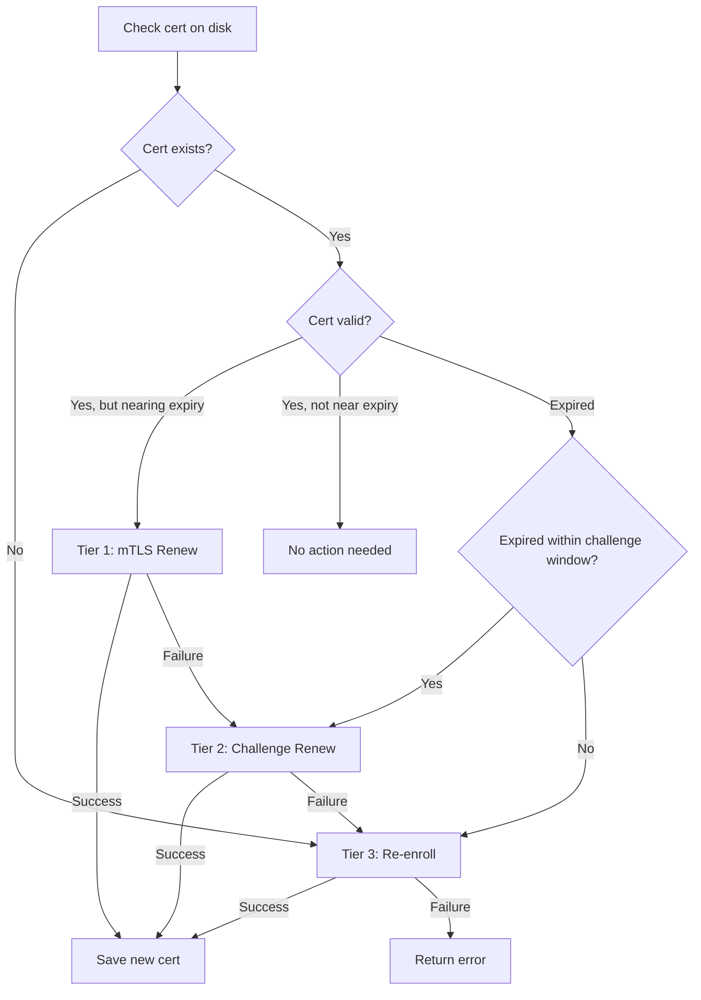

# Imprint: Design Document

This document captures the design of Imprint, a reusable Go library for device enrollment and mutual TLS (mTLS) authentication. It serves as the authoritative reference for the library's architecture, protocol, and cross-language compatibility.

---

## Table of Contents

1. [Purpose](#purpose)
2. [Two-Factor Identity Model](#two-factor-identity-model)
3. [Hardware Fingerprint Generation](#hardware-fingerprint-generation)
4. [Enrollment Flow](#enrollment-flow)
5. [mTLS After Enrollment](#mtls-after-enrollment)
6. [Certificate Renewal](#certificate-renewal)
7. [Enrollment Modes](#enrollment-modes)
8. [Package Architecture](#package-architecture)
9. [API Surface](#api-surface)
10. [Shared Types](#shared-types)
11. [Dependencies](#dependencies)
12. [Cross-Language Compatibility](#cross-language-compatibility)
    - [Protocol-First Design](#protocol-first-design)
    - [Integration Approaches](#integration-approaches)
    - [Fingerprint Computation Spec](#fingerprint-computation-spec)

---

## Purpose

**Imprint** - evokes "fingerprint" (unique machine identity) and "making an impression" (registering with a service). The library provides a complete device-to-service trust establishment protocol:

1. Generate a unique, stable identity for a device (fingerprint)
2. Enroll the device with a service (prove authenticity, receive credentials)
3. Authenticate ongoing communication via mTLS (mutual TLS)

Imprint is not specific to any single product. It can be imported by any Go project that needs device-level authentication - update services, remote support applications, IoT management planes, or any system where software running on a machine needs to prove its identity to a backend.

```
                   +-------------------+
                   |     Imprint       |
                   |  (Go library)     |
                   +--------+----------+
                           /|\
                          / | \
                         /  |  \
           +------------+   |   +------------------+
           | update-    |   |   | device-manager   |
           | service    |   |   | (example)        |
           +------------+   |   +------------------+
                            |
                   +--------+----------+
                   |   Any product     |
                   |  that needs       |
                   |  device identity  |
                   +-------------------+
```

---

## Two-Factor Identity Model

Authentication requires two independent factors:

```
Factor 1: Build Secret ("has fingers")
  - Compiled into every binary via ldflags at CI build time
  - Same value across all builds of a given release
  - Proves: "I am genuine software from a trusted build pipeline"
  - Only the CI pipeline knows this value
  - Only used during enrollment (not on every request)

Factor 2: Hardware Fingerprint ("unique fingerprint")
  - Derived from machine-specific attributes
  - Unique per installation / physical or virtual machine
  - Proves: "I am THIS specific instance"
  - Generated on first boot, stable across restarts
```

Together they answer: **"Is this a real [product] instance, and which one is it?"**

A request during enrollment without a valid build secret is rejected outright - it's not genuine software. A request with a valid build secret but an unknown fingerprint is a new device introducing itself for the first time.

---

## Hardware Fingerprint Generation

Fingerprints are generated using a tiered strategy that adapts to the runtime environment:

**Tier 1 - Hardware (bare metal, VMs)**

Collect machine-specific attributes and hash them together with SHA-256:

| Platform | Attributes |
|----------|-----------|
| Linux | `/etc/machine-id` + `/sys/class/dmi/id/product_uuid` + primary NIC MAC address |
| Windows | `HKLM\SOFTWARE\Microsoft\Cryptography\MachineGuid` (registry) + primary NIC MAC address |
| macOS | `IOPlatformUUID` + primary NIC MAC address |

Result: a deterministic, hardware-derived hash. Stable across reboots. Changes only if hardware is replaced or OS is reinstalled (which is arguably a "new device" from a licensing perspective).

**Tier 2 - Persisted identity (containers with volumes)**

If hardware attributes are insufficient or unavailable (e.g., inside a container where `/etc/machine-id` is ephemeral and DMI data doesn't exist), check for an existing identity file at a configured path (e.g., `/data/imprint/identity`). If found, use its contents as the fingerprint.

This handles the container case: the identity is stored on a persistent volume and survives container recreation.

**Tier 3 - Generated identity (first boot, any environment)**

If no hardware attributes and no persisted identity exist, generate a random UUID, persist it to the configured directory, and use its SHA-256 hash as the fingerprint. From this point forward, the device has a stable identity.

**Container considerations:**

- Containers don't have stable hardware identifiers. The tiered strategy handles this by falling back to persisted identity files on mounted volumes.
- If a container AND its volume are both destroyed, the fingerprint changes. The device enrolls again as a new instance. The old enrollment record can be cleaned up manually or via expiry.
- Multiple containers on the same host get independent identities (each has its own volume), avoiding collision.
- The consuming service doesn't care HOW the fingerprint was generated, it's just a unique, stable string.

**Output format:** `"sha256:<hex>"` - a string containing the hash algorithm prefix and the hex-encoded hash value.

The `Generate()` function also reports which tier was used (hardware, persisted, generated) for diagnostics and logging.

---

## Enrollment Flow

Enrollment is the one-time handshake where a device proves its identity and receives mTLS credentials. The private key never leaves the device.

```
Device (first boot)                           Service
      |                                          |
      |-- 1. Generate ECDSA P-256 keypair + CSR   |
      |-- 2. Compute hardware fingerprint        |
      |-- 3. Create CSR (cert signing request)   |
      |       containing fingerprint + hostname  |
      |                                          |
      |-- 4. POST /api/v1/enroll  -------------->|
      |       {                                  |
      |         build_secret: "...",             |-- 5. Validate build secret
      |         fingerprint: "sha256:...",       |      (constant-time comparison)
      |         hostname: "prod-01",             |
      |         os: "linux",                     |-- 6. Check enrollment mode
      |         arch: "amd64",                   |      (auto/token/approval)
      |         csr: "-----BEGIN CSR-----..."    |
      |       }                                  |-- 7. Check if fingerprint
      |                                          |      already enrolled
      |                                          |      (re-enrollment case)
      |                                          |
      |                                          |-- 8. Sign CSR with CA key
      |                                          |      CN = generated server_id
      |                                          |      SAN URI = imprint://server/<id>
      |                                          |
      |                                          |-- 9. Store enrollment record
      |                                          |
      |<-- 10. 200 OK  --------------------------|
      |       {                                  |
      |         server_id: "srv_abc123",         |
      |         certificate: "-----BEGIN...",    |
      |         ca_certificate: "-----BEGIN..."  |
      |       }                                  |
      |                                          |
      |-- 11. Store private key + cert + CA      |
      |       to disk                            |
```

Key points:
- The device generates its own keypair and sends a CSR (Certificate Signing Request), not the private key
- The private key is generated on-device and never transmitted
- The service signs the CSR with its internal CA and returns the signed certificate
- The device stores three files: private key, signed certificate, and CA certificate
- The server_id (a UUID) is generated by the service and embedded in the certificate's CN field

---

## mTLS After Enrollment

After enrollment, all subsequent communication uses mutual TLS. No bearer tokens, no HMAC, no signing at the application layer. Authentication is handled entirely at the transport layer.

```
Device                                        Service
  |                                              |
  |-- TLS handshake  --------------------------->|
  |   presents client cert                       |-- Verify cert signature
  |   (signed by service CA)                     |   against CA cert pool
  |                                              |-- Check cert not revoked
  |                                              |   (serial number lookup)
  |                                              |-- Extract server_id from CN
  |<-- TLS established  -------------------------|
  |                                              |
  |-- GET /api/v1/data  ----------------------->|
  |   (no Authorization header needed)           |-- Knows exactly which
  |                                              |   device this is
  |<-- 200: response  -------------------------|
```

Benefits:
- Leaked certificate is useless without the corresponding private key (which never left the device)
- Revocation is clean: flag the enrollment record and/or add the cert serial to a revocation list
- Per-device identity: the service knows exactly which server is calling, enabling logging, rate limiting, and future licensing

---

## Certificate Renewal

Client certificates issued by the Imprint CA have a configurable validity (default: 1 year via `CAConfig.Validity`). Imprint provides a three-tier renewal mechanism so that devices can maintain connectivity without manual intervention.

### Three-Tier Renewal Model

| Tier | Situation | Endpoint | Auth mechanism | Requirements |
| ---- | --------- | -------- | -------------- | ------------ |
| 1 | Cert valid, nearing expiry | `POST /api/v1/renew` (mTLS) | TLS client cert | Valid cert |
| 2 | Cert expired (within 30 days) | `POST /api/v1/renew/challenge` (public HTTPS) | Signature proof + fingerprint | Old private key + expired cert + fingerprint |
| 3 | Key lost or device rebuilt | `POST /api/v1/enroll` (public HTTPS) | Build secret + fingerprint | Build secret + fingerprint |

### Tier 1: mTLS Renewal (Happy Path)

The device presents its still-valid certificate via mTLS, sends a new CSR, and receives a fresh certificate. Identity is proven by the TLS handshake itself.

```
Device                                    Service
  |                                          |
  |-- mTLS handshake (valid cert) -------->|
  |-- POST /api/v1/renew  ---------------->|
  |   { csr }                                |-- Verify mTLS identity
  |                                          |-- Look up enrollment by CN
  |                                          |-- Sign new CSR
  |                                          |-- Update serial + RenewedAt
  |<-- { server_id, certificate, ca_cert } --|
  |-- Save new cert + key to disk            |
```

### Tier 2: Challenge-Based Renewal (Expired Cert Fallback)

When the cert has expired (but within the challenge window, default 30 days), the client proves identity by:
1. Presenting the expired certificate (to extract the public key)
2. Signing a proof digest with the old private key
3. Providing the hardware fingerprint

```
Device                                    Service
  |                                          |
  |-- POST /api/v1/renew/challenge  ------->|
  |   { server_id, fingerprint,              |
  |     expired_cert, csr, proof }           |
  |                                          |-- Verify expired cert was signed by CA
  |                                          |-- Verify cert IS expired
  |                                          |-- Verify CN matches server_id
  |                                          |-- Verify serial matches enrollment
  |                                          |-- Verify fingerprint matches (constant-time)
  |                                          |-- Verify within challenge window
  |                                          |-- Verify proof signature
  |                                          |-- Sign new CSR
  |<-- { server_id, certificate, ca_cert } --|
```

All validation failures return a generic 401 to prevent oracle attacks. Specific failure reasons are logged server-side only.

### Proof Signature Specification

The proof is a signature over a SHA-256 digest of the concatenation:

```
SHA256(server_id + "\n" + fingerprint + "\n" + csr_pem)
```

Signing is algorithm-agnostic: the client loads the old private key and dispatches based on key type. ECDSA keys sign the pre-hashed digest (`crypto.SHA256`); Ed25519 keys sign the digest bytes as a raw message (`crypto.Hash(0)`, since Ed25519 performs its own internal hashing). The signature bytes are base64-standard-encoded.

On the server side, verification dispatches based on the public key type extracted from the expired certificate:
- `*ecdsa.PublicKey`: verify with `ecdsa.VerifyASN1`
- `ed25519.PublicKey`: verify with `ed25519.Verify`
- Other: reject with logged error

### Client Fallback Logic

`RenewOrReenroll()` implements the full three-tier fallback with a client-side pre-flight check to avoid unnecessary network round-trips:



The client-side challenge window check (`time.Since(cert.NotAfter) > ChallengeWindow`) avoids a wasted Tier 2 attempt when the cert is too old. This is safe because the client has the cert on disk and can compute this locally without leaking information.

### Verifier Hardening

The `RequireMTLS` middleware enforces that the presented certificate's serial number matches the enrollment record. After renewal, the old certificate's serial no longer matches, so it is rejected. This prevents reuse of superseded certificates.

The hardened verifier also:
- Rejects unknown devices (no enrollment for the server_id in the cert CN)
- Sets an `X-Imprint-Cert-Expires` header (RFC 3339) on every successful request, allowing clients/proxies to detect approaching expiry
- Performs a single `GetByServerID` lookup instead of separate `IsRevoked` + `GetByServerID` calls

**Breaking change**: The previous verifier was lenient - if `GetByServerID` failed, the request passed with a minimal identity. The hardened verifier rejects unknown devices. Consumers upgrading will see requests rejected if their store is inconsistent.

### Security Properties

- ECDSA P-256 keypairs for all enrollment and renewal operations
- Private key never transmitted (CSR-based renewal, same as enrollment)
- Challenge proof is bound to the specific CSR, preventing replay with a different key
- Fingerprint match prevents enrollment hijacking across devices
- Serial enforcement prevents reuse of superseded certs after renewal
- Generic error responses on challenge endpoint prevent information leakage
- Challenge window limits the exposure of expired certificates
- Server and client enforce request/response size limits to prevent resource exhaustion

---

## Enrollment Modes

The enrollment mode is a server-side configuration that controls what happens when a device with a valid build secret presents an unknown fingerprint:

**auto** (current implementation): Any device with a valid build secret is immediately enrolled. Low friction, appropriate for low-stakes use cases. The wiring for other modes is in place.

**token** (future, licensing): The enrollment request must also include a pre-generated enrollment token. Tokens are created by an admin and given to operators. Tokens can carry metadata: organization, seat limits, expiration. This is the natural path to a licensing model.

**approval** (future): Enrollment is queued with status "pending". An admin reviews and approves via CLI or admin API. The device retries enrollment periodically until approved. Returns 202 Accepted during the pending period.

The data model is the same in all modes - the enrollment record structure doesn't change. The mode only gates the creation of that record.

---

## Package Architecture

```
github.com/dvstc/imprint/
  go.mod
  types.go                        # Shared types (enrollment + renewal requests/responses)

  fingerprint/                    # Device fingerprint generation
    fingerprint.go                # Generate(), Options struct, tiered strategy orchestration
    collectors.go                 # Collector interface + aggregation logic
    collectors_linux.go           # Linux: /etc/machine-id, product UUID, MAC
    collectors_windows.go         # Windows: MachineGuid registry, MAC
    collectors_darwin.go          # macOS: IOPlatformUUID, MAC
    persist.go                    # Read/write identity file (Tier 2/3)
    fingerprint_test.go

  client/                         # Client-side: enrollment, renewal, mTLS setup
    enroll.go                     # Enroll() - POST CSR to service, receive signed cert
    renew.go                      # Renew(), ChallengeRenew(), RenewOrReenroll() - three-tier renewal
    cert.go                       # CertExpiry(), NeedsRenewal(), IsExpired(), LoadCert()
    autorenew.go                  # NewAutoRenewer() - background renewal loop
    tls.go                        # LoadTLS(), ReloadableTLS() - mTLS config (static and dynamic)
    store.go                      # Save/load enrollment state (atomic writes), EnrollmentMeta
    client_test.go
    cert_test.go
    renew_test.go

  server/                         # Server-side: enrollment, renewal, mTLS verification
    ca.go                         # NewCA() - generate/load CA cert+key, sign CSRs
    handler.go                    # NewEnrollHandler() - http.Handler for POST /enroll
    renew.go                      # NewRenewHandler(), NewChallengeRenewHandler() - renewal handlers
    verifier.go                   # RequireMTLS() - hardened middleware (serial match, unknown device rejection)
    store.go                      # Store interface definition
    memstore.go                   # In-memory Store implementation (for testing)
    ca_test.go
    handler_test.go
    renew_test.go
    verifier_test.go

  integration_test.go             # End-to-end enrollment, renewal, mTLS, revocation tests
  README.md
  DESIGN.md                       # This document
  .gitignore
```

Consumers import only what they need:
- A device/client binary imports `imprint/fingerprint` and `imprint/client`
- A backend service imports `imprint/server`
- Shared types are at the root: `imprint.EnrollmentRequest`, `imprint.RenewalRequest`, `imprint.Enrollment`, etc.

---

## API Surface

**fingerprint package:**

```go
type Options struct {
    PersistDir string  // directory for identity file (required for containers)
}

type Result struct {
    Fingerprint string // "sha256:<hex>"
    Tier        string // "hardware", "persisted", "generated"
}

func Generate(opts Options) (*Result, error)
```

**client package:**

```go
// Enrollment
type EnrollConfig struct {
    ServiceURL  string
    BuildSecret string
    Fingerprint string
    Hostname    string
    OS          string
    Arch        string
    StoreDir    string
    HTTPClient  *http.Client // optional; defaults to 30s timeout
}

func Enroll(ctx context.Context, cfg EnrollConfig) (*imprint.EnrollmentResponse, error)

// Certificate Renewal
type RenewConfig struct {
    ServiceURL      string
    StoreDir        string
    ChallengeWindow time.Duration // default: 30 days
    HTTPClient      *http.Client  // optional; defaults to 30s timeout
}

func Renew(ctx context.Context, cfg RenewConfig) (*imprint.EnrollmentResponse, error)
func ChallengeRenew(ctx context.Context, cfg RenewConfig, fingerprint string) (*imprint.EnrollmentResponse, error)
func RenewOrReenroll(ctx context.Context, renewCfg RenewConfig, enrollCfg EnrollConfig, threshold time.Duration) (action string, err error)

// Certificate Inspection
func CertExpiry(dir string) (time.Time, error)
func NeedsRenewal(dir string, threshold time.Duration) (bool, error)
func IsExpired(dir string) (bool, error)
func LoadCert(dir string) (*x509.Certificate, error)

// Auto-Renewal
type AutoRenewerConfig struct {
    RenewConfig   RenewConfig
    EnrollConfig  EnrollConfig
    CheckInterval time.Duration
    Threshold     time.Duration
    OnRenew       func(action string)
    OnError       func(error)
}

func NewAutoRenewer(cfg AutoRenewerConfig) *AutoRenewer
func (ar *AutoRenewer) Start(ctx context.Context)

// TLS Configuration
func LoadTLS(storeDir string) (*tls.Config, error)        // static (short-lived processes)
func ReloadableTLS(storeDir string) (*tls.Config, error)   // dynamic (long-running + AutoRenewer)

// Storage
type EnrollmentMeta struct {
    ServerID    string
    Fingerprint string
}

func SaveEnrollment(dir string, keyPEM, certPEM, caCertPEM []byte, serverID, fingerprint string) error
func LoadMeta(dir string) (*EnrollmentMeta, error)
func IsEnrolled(storeDir string) bool
```

**server package:**

```go
// CA
type CAConfig struct {
    CertDir      string
    Organization string
    Validity     time.Duration  // default 1 year
}

func NewCA(cfg CAConfig) (*CA, error)
func (ca *CA) SignCSR(csr *x509.CertificateRequest, serverID string) (certPEM []byte, serialHex string, err error)
func (ca *CA) CACertPEM() []byte
func (ca *CA) CertPool() *x509.CertPool
func (ca *CA) ServerTLSConfig() *tls.Config

// Enrollment Handler
type EnrollConfig struct {
    CA           *CA
    Store        Store
    BuildSecrets []string
    Mode         imprint.EnrollMode
    Logger       *slog.Logger
}

func NewEnrollHandler(cfg EnrollConfig) http.Handler

// Renewal Handlers
type RenewConfig struct {
    CA     *CA
    Store  Store
    Logger *slog.Logger
}

type ChallengeRenewConfig struct {
    CA              *CA
    Store           Store
    ChallengeWindow time.Duration // default: 30 days
    Logger          *slog.Logger
}

func NewRenewHandler(cfg RenewConfig) http.Handler
func NewChallengeRenewHandler(cfg ChallengeRenewConfig) http.Handler

// mTLS Middleware
func RequireMTLS(store Store, next http.Handler) http.Handler
func RequireMTLSWithLogger(store Store, next http.Handler, logger *slog.Logger) http.Handler

func ServerIdentity(ctx context.Context) *imprint.Enrollment

// Store Interface
type Store interface {
    SaveEnrollment(ctx context.Context, e *imprint.Enrollment) error
    GetByFingerprint(ctx context.Context, fp string) (*imprint.Enrollment, error)
    GetByServerID(ctx context.Context, id string) (*imprint.Enrollment, error)
    List(ctx context.Context, filter ListFilter) ([]*imprint.Enrollment, error)
    Revoke(ctx context.Context, serverID string) error
    // IsRevoked is not used by RequireMTLS (which checks enrollment status and serial
    // match directly via GetByServerID). Remains available for direct consumer use.
    IsRevoked(ctx context.Context, serialNumber string) (bool, error)
    UpdateLastSeen(ctx context.Context, serverID string, ip string) error
    Delete(ctx context.Context, serverID string) error
}
```

---

## Shared Types

```go
package imprint

type EnrollmentRequest struct {
    BuildSecret string `json:"build_secret"`
    Fingerprint string `json:"fingerprint"`
    Hostname    string `json:"hostname"`
    OS          string `json:"os"`
    Arch        string `json:"arch"`
    CSR         string `json:"csr"`
}

type EnrollmentResponse struct {
    ServerID      string `json:"server_id"`
    Certificate   string `json:"certificate"`
    CACertificate string `json:"ca_certificate"`
}

type RenewalRequest struct {
    CSR string `json:"csr"`
}

type ChallengeRenewalRequest struct {
    ServerID    string `json:"server_id"`
    Fingerprint string `json:"fingerprint"`
    ExpiredCert string `json:"expired_cert"`
    CSR         string `json:"csr"`
    Proof       string `json:"proof"`
}

type Enrollment struct {
    ServerID     string
    Fingerprint  string
    Hostname     string
    OS           string
    Arch         string
    SerialNumber string       // cert serial number (hex), for serial match
    EnrolledAt   time.Time
    RenewedAt    time.Time    // zero value = never renewed
    LastSeenAt   time.Time
    LastIP       string
    Status       string       // "active", "revoked", "pending"
}
```

`EnrollmentResponse` is shared across enrollment and renewal - both flows return a server_id, new certificate, and CA certificate. The action context (enrollment vs renewal) is determined by which handler processed the request, not by the response payload.

`EnrollmentMeta` (in `client` package) stores `ServerID` and `Fingerprint` alongside the certificates on disk, allowing the renewal flow to read the fingerprint without requiring it as a parameter.

`RenewedAt` is set to `time.Now()` by both renewal handlers. `EnrolledAt` is preserved from the original enrollment.

---

## Dependencies

- `golang.org/x/sys` - Windows registry access for fingerprinting
- Otherwise stdlib only: `crypto/x509`, `crypto/ecdsa`, `crypto/tls`, `crypto/rand`, `crypto/sha256`, `encoding/pem`, `net/http`

---

## Cross-Language Compatibility

Imprint is designed as a Go library, but the enrollment protocol and identity system must be usable from any language. Projects built in .NET Core, Python, Rust, or any other stack should be able to enroll devices and authenticate via mTLS without depending on Go code.

### Protocol-First Design

Every component of Imprint is built on open, universal standards:

| Imprint concept | Underlying standard | Cross-language support |
|---|---|---|
| Hardware fingerprint | SHA-256 hash of machine attributes | Every language has SHA-256 and OS-level system info APIs |
| Enrollment request | HTTP POST with JSON body | Universal |
| CSR (cert signing request) | X.509 / PKCS#10 | .NET `CertificateRequest`, Python `cryptography`, Rust `rcgen`, etc. |
| Client certificate | PEM-encoded X.509 | Universal |
| mTLS | Standard TLS with client certificates | Every HTTP client library supports this |

The Go package is the **reference implementation**. Other languages implement the same protocol - they are compatible because they follow the same spec, not because they share code.

A service using Imprint doesn't know or care what language the client is written in. It receives a standard HTTP POST with JSON, validates the build secret, signs a standard X.509 CSR, and returns PEM certificates. Any language that can make HTTPS requests and handle X.509 certificates can participate.

### Integration Approaches

Three approaches, from simplest to most integrated:

**1. CLI bridge (zero reimplementation)**

Build a standalone `imprint` CLI from the Go library:

```
imprint fingerprint                                    --> prints fingerprint to stdout
imprint enroll --url ... --secret ... --dir ./certs    --> enrolls, writes certs to disk
```

A .NET, Python, or any other app shells out to the CLI for enrollment, then loads the certificate files directly for mTLS. Example in C#:

```csharp
var cert = X509Certificate2.CreateFromPemFile("certs/client.crt", "certs/client.key");
handler.ClientCertificates.Add(cert);
```

The Go CLI handles fingerprinting, enrollment, and cert storage. The consuming application only needs to load PEM files and configure its HTTP client for mTLS - something every language supports natively.

Best for: quick integration, prototyping, projects where adding a single CLI binary alongside the app is acceptable.

**2. Native implementation from protocol spec (most integrated)**

Implement the Imprint client protocol directly in the target language. The logic is straightforward:

1. Collect machine attributes (platform-specific, see fingerprint computation spec below)
2. Compute the SHA-256 fingerprint (deterministic, byte-level spec provided)
3. Generate a keypair and CSR using the language's crypto library
4. POST JSON to the enrollment endpoint
5. Store PEM files to disk
6. Load them for mTLS

The fingerprint computation spec (below) ensures byte-identical output across implementations.

Best for: production systems where you don't want to distribute a separate CLI binary, or when deeper integration is needed (e.g., the enrollment flow is embedded in the application's own setup wizard).

**3. C shared library via FFI (exact Go implementation)**

Go can compile to a C shared library (`go build -buildmode=c-shared`), producing a `.dll` (Windows), `.so` (Linux), or `.dylib` (macOS). Other languages can call into it via their FFI mechanisms (.NET P/Invoke, Python ctypes, etc.).

This gives the exact Go implementation callable from any language, but adds complexity: FFI type marshaling, native binary distribution per platform, and memory management across the boundary. Generally not worth it given that the protocol is simple enough to reimplement natively.

Best for: cases where byte-identical behavior is critical and reimplementation is undesirable.

### Fingerprint Computation Spec

For cross-language implementations to produce identical fingerprints, the computation must be deterministic at the byte level. This is the canonical algorithm:

**Input collection (platform-specific):**

| Platform | Attribute | Source | Normalization |
|----------|-----------|--------|---------------|
| Linux | machine_id | `/etc/machine-id` | Read file, trim trailing whitespace/newlines, lowercase |
| Linux | product_uuid | `/sys/class/dmi/id/product_uuid` | Read file, trim trailing whitespace/newlines, lowercase |
| Linux | mac_address | Primary NIC hardware address | Lowercase hex with colons: `aa:bb:cc:dd:ee:ff` |
| Windows | machine_guid | `HKLM\SOFTWARE\Microsoft\Cryptography\MachineGuid` | Read registry value, trim whitespace, lowercase |
| Windows | mac_address | Primary NIC hardware address | Lowercase hex with colons: `aa:bb:cc:dd:ee:ff` |
| macOS | platform_uuid | `IOPlatformUUID` via IOKit | Trim whitespace, lowercase |
| macOS | mac_address | Primary NIC hardware address | Lowercase hex with colons: `aa:bb:cc:dd:ee:ff` |

"Primary NIC" is defined as: the first non-loopback, non-virtual network interface that has a hardware (MAC) address, sorted alphabetically by interface name. This ensures deterministic selection across runs.

**Hash computation:**

1. Collect all available attributes for the current platform (some may be absent - skip any that can't be read)
2. Sort the collected key-value pairs alphabetically by key name
3. For each pair, write to a SHA-256 hasher: `key=value\n` (UTF-8 encoded, newline-terminated)
4. Finalize the hash
5. Format as: `sha256:<lowercase_hex>`

Example (Linux with all attributes available):

```
Input to hasher (bytes, UTF-8):
  mac_address=aa:bb:cc:dd:ee:ff\n
  machine_id=a1b2c3d4e5f6...\n
  product_uuid=12345678-abcd-...\n

Output: sha256:7f83b1657ff1fc53b92dc18148a1d65dfc2d4b1fa3d677284addd200126d9069
```

This spec ensures that a Go implementation, a C# implementation, and a Python implementation all produce the exact same fingerprint for the same machine.

